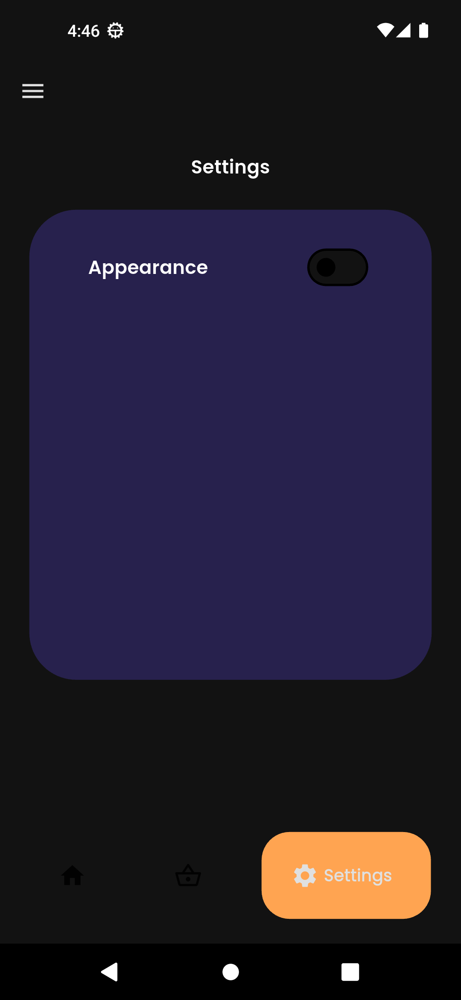

# [MOCK APP] E-Commerce Mobile App

A Flutter-based e-commerce mobile application featuring user authentication, product browsing, and shopping cart functionality. This project serves as a portfolio demonstration of mobile app development skills using Flutter and modern state management practices.

## 🚀 Features

### Authentication System
- **Mock Login & Register**: Complete authentication flow with credential validation
- **Data Persistence**: User credentials stored using SharedPreferences for simplified mock implementation
- **Form Validation**: Email format validation and password length requirements (minimum 6 characters)

### User Interface
- **Login Page**: Email and password form with proper validation
- **Register Page**: Three-field registration form (email, password, confirm password)
- **Success Screen**: Registration confirmation with navigation back to login

### Main Application
- **Bottom Navigation**: Clean navigation using Google's GNav package
- **Responsive Design**: Optimized for mobile devices with intuitive user experience

## 📱 Core Screens

### Shop Screen
The main e-commerce interface featuring two primary sections:

**Recommended Products**
- Complete product listing built with ListView.builder
- Product cards displaying:
  - Product images
  - Product names
  - Pricing information
  - Add to cart functionality

**Category Filter**
- Segmented button control with three categories: "Hottest", "Popular", "New"
- Dynamic product filtering based on selected category
- Horizontal product list with essential product information

### Basket Screen
Shopping cart management interface:
- **Cart Items Display**: Vertical list of added products using ListTile widgets
- **Item Management**: Individual delete buttons for cart item removal
- **Cart Persistence**: Maintains cart state throughout the session

## 🛠️ Technical Implementation

### State Management
- **Provider Pattern**: Implemented for efficient state management across the application
- **Local Storage**: SharedPreferences for temporary data storage and user session management

### Dependencies
```yaml
dependencies:
  - provider: State management solution
  - google_fonts: Typography and font styling
  - shared_preferences: Local data persistence
  - google_nav_bar: Bottom navigation implementation
```

### Additional Features
- **Navigation Drawer**: 
  - User information display
  - Logout functionality
  - Additional menu options
- **Settings Page**: Theme mode customization
- **Responsive Navigation**: Seamless navigation between different sections

## 🎨 Design Reference

The UI/UX design is based on a public Figma community template:
[Mobile UI Kit - Ecommerce](https://www.figma.com/design/83pAC9rzbvwUY5s3fc6tLN/Mobile-UI-Kit--Ecommerce--Community-?node-id=47-3061&t=kOdnFRa0gKoxvm6l-1)

## 🏗️ Architecture

This project demonstrates:
- **Clean Architecture**: Separation of concerns with organized folder structure
- **Mock Implementation**: Simplified approach avoiding cloud services and external databases
- **State Management**: Efficient use of Provider pattern for app-wide state
- **Form Validation**: Proper input validation and user feedback
- **Navigation Management**: Multi-screen navigation with persistent state

## 🚀 Getting Started

### Prerequisites
- Flutter SDK (latest stable version)
- Dart SDK
- Android Studio / VS Code with Flutter extensions

### Installation
1. Clone the repository
```bash
git clone https://github.com/sandeeffendi/flutter_ecommerce_mock_application.git
```

2. Navigate to project directory
```bash
cd ecommerce-app
```

3. Install dependencies
```bash
flutter pub get
```

4. Run the application
```bash
flutter run
```

## 📱 Screenshots

<p align="center">
  
  
  
  
  
  
</p>


## 🤝 Contributing
This is a portfolio project, but feedback and suggestions are welcome!

## 📄 License
This project is created for portfolio purposes.

---
**Built with Flutter 💙**
